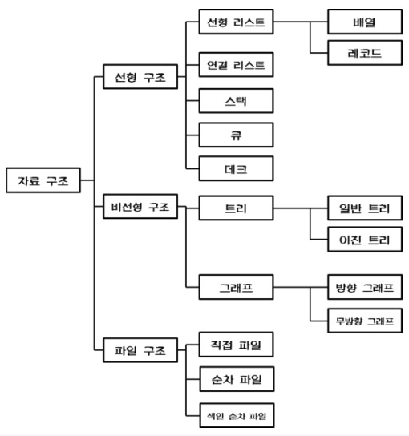
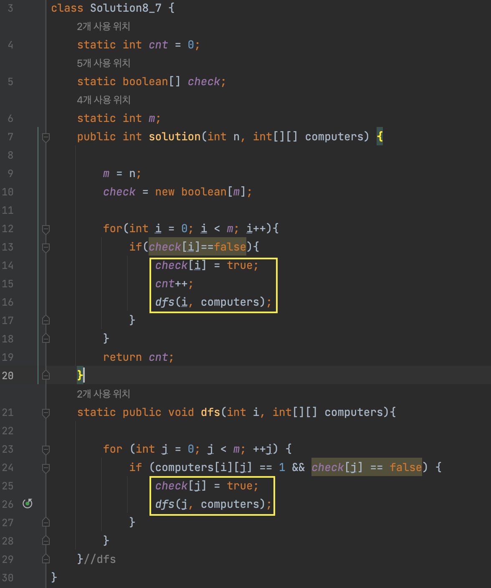
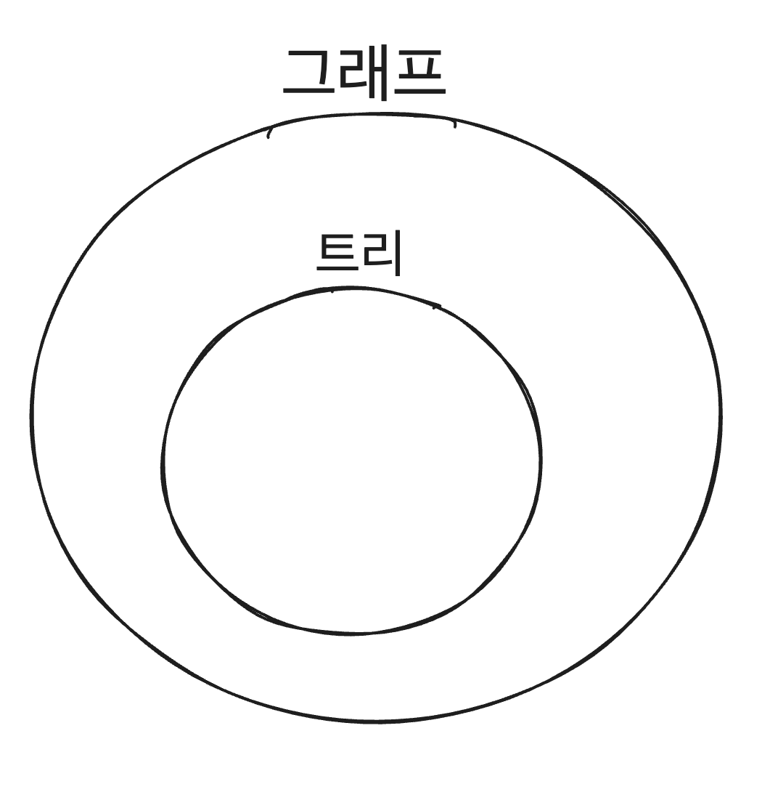

# PS
## Algorithm_solution

----

# 3-2. 탐색

## 선형탐색 ( = 순차탐색 = Linear(선형) Search = Sequential(순차) Search)

- Linear Search는 정렬 여부와 관계없이 **모든 데이터를 순서대로 확인하는 알고리즘**이며, 여기서 "선형"이라는 말은 탐색 과정에서 **시간 복잡도가 데이터 크기와 선형적으로 증가**한다는 점을 강조한 것이다.
- 정렬 여부에 관계없이 단순히 순서대로 모든 값을 확인하여 원하는 값을 찾는 탐색 방법을 말한다.
   

- 탐섹 방식
  - 데이터 구조(배열, 리스트 등)의 첫 번째 요소부터 순서대로 하나씩 확인하며 목표값을 찾는다.
- 시간복잡도
  - 최악의 경우 O(n)

### Sequential Search와 Linear Search의 용어 선택의 차이

- Sequential Search : "순차 탐색"이라는 의미로, 탐색 과정을 강조한 표현이다.

- Linear Search : "탐색이 선형적인 시간 복잡도O(n)를 가진다"는 점을 강조한 표현이다.

  - 여기서 선형의 의미란?

    - 수학적 의미 : 데이터 크기 n에 비례하여 O(n)시간이 걸린다는 뜻을 말한다.

    - 탐색 과정 : 데이터 구조의 처음부터 끝까지 순차적으로(순서대로) 접근하는 방식이므로 "Linear(선형)"이라고 한다. 탐색 과정에서 정렬의 유무는 중요하지 않다. 하나하나 비교해 나가는 과정 자체가 선형적이라고 표현하는 것이다.

      > '순서'와 '정렬'의 개념 헷갈리지 말 것!
      >
      > **순서**: 데이터를 처음부터 끝까지 순차적으로 탐색하는 과정을 말한다.
      >
      > - Linear Search는 "순서"대로 탐색한다.
      >
      > **정렬**: 데이터가 특정 기준(오름차순/내림차순)으로 배열되어 있는 상태를 의미한다.
      >
      > - Linear Search는 **정렬 여부에 의존하지 않는다.**

  - 선형 자료구조란?

    - **선형 자료구조**는 **데이터가 순서대로 나열된 구조**를 의미하며, 여기서의 "선형"은 **정렬**이 아닌, 데이터가 **일렬로 연결되어 있는 형태**를 나타낸다.
    - 선형 자료구조의 예 : 배열, 연결리스트(Linked List), 스택(LIFO), 큐(FIFO)

  - ### 선형 자료구조 vs 비선형 자료구조

    | **특징**             | **선형 자료구조**                      | **비선형 자료구조**                                      |
    | -------------------- | -------------------------------------- | -------------------------------------------------------- |
    | **구조**             | 데이터가 순차적으로 연결됨             | 데이터가 계층적(트리) 또는 네트워크형(그래프)으로 연결됨 |
    | **예**               | 배열, 연결 리스트, 스택, 큐            | 트리, 그래프                                             |
    | **데이터 접근 방식** | 한 번에 하나씩 순서대로 탐색           | 여러 경로를 통해 탐색 가능                               |
    | **연결 관계**        | 자료들간의 앞뒤 관계가 1:1 관계를 가짐 | 자료들 간의 앞뒤 관계가 1:n, 또는 n:n 의 관계            |

---

# 이진 탐색 ( = 이분 탐색 ≒ ParaMetric Search)

## 이분 탐색은 어떤 상황에서 쓰는가?

- 선형탐색을 해야하는 상황인데 정렬이 되어 있다면 이때 이분탐색을 쓴다. 이분탐색은 시간복잡도를 logN까지 줄여줄 수 있기때문에 훨씬 효율적이다.
- 이진탐색(=이분탐색)을 쓰려면은 쓰는 대상의 자료구조가 그래프같은 비선형 자료구조가 아닌 선형 자료구조(순서가 있음)일때 쓴다.

---

# DFS

### DFS유형 문제풀이 접근 방법

백준기준에서 문제를 주어지면은 입력값으로 (a)정점 N개, (b)  간선 관계 M개 를 주어진다. 그러면 PS푸는 사람이 이 (a)와 (b)를 가지고 인접배열(NxN) 또는 인접리스트로 만든 후 풀이를 시작한다.

1. 노드 전체 갯수를 파악한다.

2. 각 노드마다 먼저 지나간 노드인지 check를 하고 check가 안되어 있으면 check후에 DFS탐색 진행한다.

    

   

   

---

# 그래프

 

~~~
1. 결정알고리즘 상황에서 쓴다.
~~~

